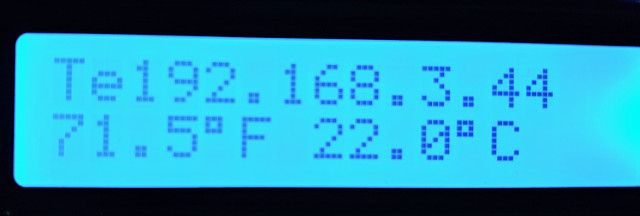
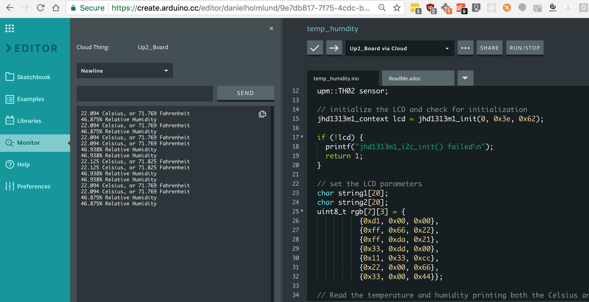

# Introduction to I<sup>2</sup>C and the LCD Display

## Objective

The objective of this lab is a learn the basics of an example that uses the I<sup>2</sup>C bus to control the LCD Display.

In this lab, you will change the LCD background color to Intel Blue and display the text "Intel Blue"

## Disable the Program Writing the IP Address to the LCD

When you boot the Up2 Board, there is a system service that launches at boot that will display your IP address on an LCD. **This program is running in the background and you need to disable it before you can use the LCD in a lab.**

 Open a terminal and SSH to the Up2 Board

```bash
ssh upsquared@<your ip address>
```

Run this command to stop the ip_addr_c service.

```bash
systemctl stop ip_addr_c
```

Now you can process with labs that make use of the LCD screen.

## Identifying When You Are Running Multiple Processes Using I2C

It's often problematic to run more that one program that makes use of I2C simultaneously. Here are two way that you can know if this is happening:

1. Text on the LCD display is garbled, or text is overwriting previously displayed text in a confusing manner.
   

2. I<sup>2</sup>C bus errors. Sometimes multiple processes writing to the I<sup>2</sup>C bus will cause the I<sup>2</sup>C bus subsystem to crash. If you are seeing an I<sup>2</sup>C error then rebooting the Up2 will often fix the problem.

## Hardware requirements

| Module      | Pin                     |
| ----------- | ----------------------- |
| LCD Display | Any I<sup>2</sup>C Port |

 Connect **LCD Display** to Any I<sup>2</sup>C Port.

## I<sup>2</sup>C++ using the Arduino API

Create a new project

```c++
#include "jhd1313m1.hpp"

upm::Jhd1313m1 lcd(0, 0x3e, 0x62);

void setup(void)
{  
  // Initialize the subplatform
  mraa_add_subplatform(MRAA_GROVEPI, "0");
  
  lcd.setCursor(0, 0);

  lcd.write("Intel Blue");
  
  // Change the color to Intel Blue ;)
  uint8_t r = 0;
  uint8_t g = 113;
  uint8_t b = 197;

  lcd.setColor(r, g, b);

  // Debugging output to the serial monitor
  printf("rgb: 0x%02x%02x%02x\n", r, g, b);
}

void loop() {
  delay(1000);
}
```

## Viewing the Serial Monitor

Be sure to use the serial monitor to debug your programs.
It can be found in the left side bar.



## Additional resources

Information, community forums, articles, tutorials and more can be found at the [Intel Developer Zone](https://software.intel.com/iot).

For reference code for any sensor/actuator from the Grove\* IoT Commercial Developer Kit, visit [https://software.intel.com/en-us/iot/hardware/sensors](https://software.intel.com/en-us/iot/hardware/sensors)
